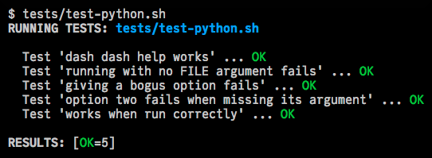

# smash

A simple, minimalist test harness for functional testing of command-line
programs, in ~200 lines of Bash script.


I don't write enough tests. I think the friction comes from trying to
understand how other people's test frameworks work. So much boilerplate!
There's `setUp`s and `tearDown`s and mocks and factory functions and a
dozen different assertions you have to try to memorize! That's all warranted
for very big, very professional projects, but I'm not working at that scale.

Smash was extracted from a test script I wrote for some other
moderately-complex command-line utility, where it made sense to abstract out
the repetitive parts into a library of sorts. Its current and planned
**intentionally-narrow scope** is

* it tests return/exit codes and yields an error if it doesn't match the
  expected (_e.g._, `_exit_code=2`)
* it tests that output matches [a pattern](#pattern-matching) you provide
  (_e.g._, `_stdout='.*some output.*'`)
* it tests that stderr is either empty, or matches
  [a pattern](#pattern-matching) you provide (_e.g._, `_stderr='.*expected
  error message'`)
* and it automatically cleans up temp files/directories that you
  designate within a test block (_e.g._, `_temp_file=$(mktemp XXXXXX)`)

That's it.

## Installation

I don't want to have to _install_ something, so this will always and only ever
be one file that you `source` at the beginning of your test script.

```bash
# if you're on the cluster, you'll need a proxy connection
pck || pon

# change into your 'tests' directory, then
wget -O sma.sh https://tf.cchmc.org/s/get-smash

# or
curl -Lo sma.sh https://tf.cchmc.org/s/get-smash
```

## Usage

Key points for writing test scripts:

* programs under test are wrapped in shell functions
* the first part of the test function's name must match the test _filename_,
  with the extension removed, and with dashes converted to underscores
    * _e.g._, test functions in `test_my-groovy-script.sh` must start with
      `test_my_groovy_script_` if they are to be auto-discovered
    * see [the example below](#example)
    * this restriction may change, though; see #2
* the conditions of the test are specified using "magic" variables;
  [see below](#magic-variables)
* finally, you invoke the test executor with `run_tests` at the bottom

### "Magic" variables

Currently, smash recognizes the following directives through the use of magic
variables defined in the body of individual test functions:

| Magic variable | …expects this         | …and does this
| -------------- | ------------          | ------------------
| `_stdout`      | an ERE<sup>\*</sup>   | requires that pattern matches the _entire_ stdout output
| `_stderr`      | an ERE<sup>\*</sup>   | requires that pattern matches the _entire_ stderr output
| `_exit_code`   | a number              | requires that the program under test returns this exit code
| `_temp_file`   | `$(mktemp XXXXXX)`    | removes this file after the test finishes, except if `--no-cleanup` is given
| `_temp_dir`    | `$(mktemp -d XXXXXX)` | recursively removes this directory after the test finishes, except if `--no-cleanup` is given

_<sup>*</sup>**ERE** = extended or "modern" regular expression; see [`man 7 regex`](https://linux.die.net/man/7/regex)_

### Example

The names and descriptions of the tests auto-discovered from the names of the
functions in your test script (_e.g._, `test_termlf_dash_dash_help_works`) and
then you just add `run_tests` at the bottom.

A typical test script looks like this:

```bash
#!/usr/bin/env bash
# test-python.sh - test suite for a script named 'python.py'

# assuming 'sma.sh' is stored alongside the test script
source "$(dirname "$0")/sma.sh"

# '--help' produces expected message on stdout and returns 0 (success)
test_python_dash_dash_help_works() {
    _stdout='.*To report bugs, visit: https?://.*'
    python.py --help
}

# returns 2 and has expected error message on stderr
test_python_running_with_no_FILE_argument_fails() {
    _exit_code=2
    _stderr='.*the following arguments are required: FILE'
    python.py
}

⋮
run_tests
```

and a typical run looks like this:



## Pattern matching

The patterns used in the magic variables `_stderr=` and `_stdout=` are "modern"
(or what POSIX refers to as "extended") regular expressions.

When tested, your pattern is automatically anchored at the start and end, like
so:

```bash
if [[ $stdout =~ ^$_stdout$ ]]; then …
```

As a result, if these variables are undefined or set to the empty string, it
signifies that _nothing_ appeared on that particular output stream. This also
means that _your_ pattern must match the whole line if you want to match a
substring somewhere in the middle, _e.g._, `.*something in the middle.*`.

In case you were wondering, [Bash's double square bracket conditionals][re]
support alternation with "`|`" and the parentheses in capture subexpressions
such as `(.*)` do not need to be escaped with backslashes.

This means that **you** will need to escape RE metacharacters like `[`, `(`,
`.`, `?`, and `*` if you want to match them literally, and you will probably
want to use a single-quoted string so you don't have to escape the `\`s, too.
This should rarely be necessary, though; just use `.*` and do a less precise
match instead.

## B-b-b-but, what happens if I need to …?

This test framework written _in_ Bash, primarily for testing small
programs written in scripting languages such as Bash, Perl, and Python.

The intention is that the built-in capabilities of the Bash shell will be
used to assemble the conditions for test cases, and smash, apart from
checking outputs and return values, should mostly stay out of the way.
If you can get "it" to produce output that you can match with `_stdout`
or `_stderr` and return zero/non-zero, you can already test "it" with
smash.

In the Unix shell, the return value of a function is either that of an
explicit `return` statement, or else that of the last command to run. This
is what smash will check to determine if the test passed or failed.

Want to compare known-good input with known-good output? Wrap a test
function around `diff`, which always returns 1 if there are differences,
0 if there are none.

Want to test some web site is up, or an API is returning good data? Just
use `curl -sS`, or pipe into `grep -q`, or match `_stdout` against part
of the expected response.

## To-dos

- [ ] give some help if `sma.sh` is run directly
- [ ] create a separate `smashquiz` comand (maybe in Rust!) that helps build
  the test script(s) by asking a series of questions

## References

* for clarity on what is meant by a "test harness" see
  <https://en.wikipedia.org/wiki/Test_harness>

## Credits

Graphic is "Smash capitalism" from
[openclipart.org](https://openclipart.org/detail/1090/smash-capitalism)

## Author

Kevin Ernst ([ernstki@mail.uc.edu](mailto:ernstki@mail.uc.edu))

Copyright Cincinnati Children's Hospital Medical Center and the author(s).

## License

MIT.

[re]: https://www.gnu.org/software/bash/manual/html_node/Conditional-Constructs.html#index-_005b_005b
